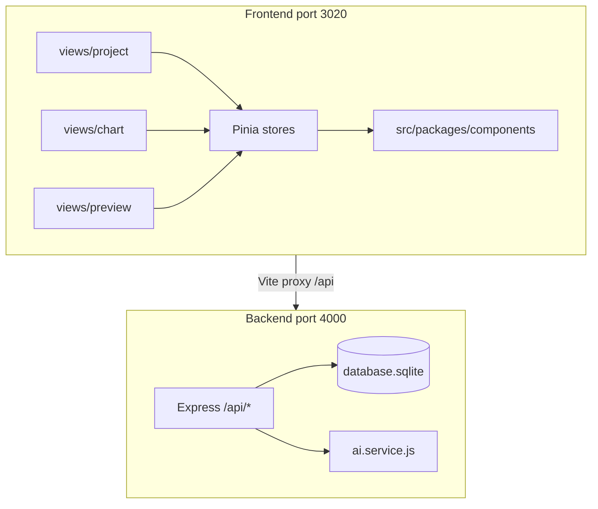

# AI agent instructions — TiniX Visualization

**TiniX Visualization** is a local-first, AI-powered low-code platform for building dashboards and analytics reports. Users drag chart components onto a canvas, bind data from files/APIs/datasets, and optionally use **Auto-BI** (OpenRouter LLM) to suggest charts from uploaded data. Projects persist to a local **SQLite** database via an Express backend.

---

## Tool hubs

| Tool | Hub |
|------|-----|
| **Cursor** | [`.cursor/CURSOR.md`](.cursor/CURSOR.md) |
| **Kiro** | [`.kiro/KIRO.md`](.kiro/KIRO.md) |
| **Claude Code** | [`.claude/CLAUDE.md`](.claude/CLAUDE.md) |

- **Cursor:** `.cursor/rules/` (`.mdc`), `.cursor/commands/`, `.cursor/mcp.json`
- **Kiro:** `.kiro/steering/` (`*.md`), `.kiro/commands/`, `.kiro/settings/mcp.json`
- **Claude Code:** `.claude/rules/`, `.claude/commands/`

**Cross-tool continuity:** committed [`.agent/SESSION.md`](.agent/README.md) — use `/resume` at session start and `/handoff` at session end.

When editing `.cursor/rules/`, mirror changes to `.claude/rules/` and `.kiro/steering/` to keep all three tools aligned.

---

## Tech stack

| Layer | Technology |
|-------|------------|
| **Frontend** | Vue 3.5 (Composition API), Vite 4, TypeScript 4.6 |
| **UI** | Naive UI, SCSS, animate.css, vue-i18n |
| **State** | Pinia |
| **Routing** | vue-router 4 (hash history) |
| **Charts** | ECharts 5, @visactor/vchart, vue-echarts, Three.js (3D decorates) |
| **Editor UX** | vue3-sketch-ruler, vuedraggable, keymaster, monaco-editor |
| **HTTP client** | axios (`src/api/axios.ts`) |
| **Backend** | Node.js Express (`server/`) |
| **Database** | SQLite via better-sqlite3 (`server/database.sqlite`) |
| **AI (Auto-BI)** | OpenRouter or LiteLLM proxy | `server/ai.config.js`, `server/ai.service.js` |

Project-specific stack and structure rules live in `.cursor/rules/tech-stack.mdc` and `.cursor/rules/project-structure.mdc`. **Security rules always apply** regardless of stack.

---

## Architecture



### Routes (from `src/enums/pageEnum.ts`)

| Path | Purpose |
|------|---------|
| `/project/items` | My projects list |
| `/project/my-template` | User templates |
| `/project/template-market` | System template market (100+ templates) |
| `/project/data-management` | Dataset library + Auto-BI wizard |
| `/chart/home/:id` | Dashboard editor (drag-drop canvas) |
| `/chart/preview/:id` | Read-only preview / published viewer |
| `/chart/edit/:id` | JSON editor for chart config |
| `/login` | Login page |

---

## Directory guide

```
tinix-visualization/
├── src/
│   ├── main.ts                 # App bootstrap
│   ├── views/
│   │   ├── project/            # Project hub, templates, data management, Auto-BI
│   │   ├── chart/              # Editor: canvas, layers, config panels, header
│   │   ├── preview/            # Published / iframe viewer
│   │   └── edit/               # JSON config editor
│   ├── packages/
│   │   ├── components/         # Chart library (Charts, VChart, Decorates, Tables, …)
│   │   ├── chartConfiguration/ # Shared ECharts/VChart option builders
│   │   └── index.ts            # createComponent, fetchChartComponent
│   ├── store/modules/          # Pinia stores (chartEditStore is editor core)
│   ├── api/
│   │   ├── axios.ts            # HTTP client (baseURL /api)
│   │   ├── storage.api.ts      # Projects, datasets, templates, settings, Auto-BI
│   │   └── mock/               # vite-plugin-mock fixtures
│   ├── components/             # Shared Go* UI wrappers
│   ├── router/modules/         # project, chart, preview, edit route modules
│   ├── settings/               # Chart themes, design defaults
│   ├── hooks/                  # useChartDataFetch, useChartDataPondFetch
│   └── utils/
├── server/
│   ├── index.js                # Express REST API
│   ├── db.js                   # SQLite schema + connection
│   ├── ai.service.js           # OpenRouter Auto-BI logic
│   └── database.sqlite         # Local persistence (generated at runtime)
├── plop/                       # Pinia store generator scaffold
└── build/                      # Vite build constants
```

### Pinia stores

| Store | Role |
|-------|------|
| `chartEditStore` | Canvas state, component list, selection, undo/redo integration |
| `chartHistoryStore` | Undo/redo history stack |
| `chartLayoutStore` | Editor layout panels |
| `packagesStore` | Private photo library |
| `settingStore` / `designStore` | Global design settings |
| `langStore` | i18n preference |

### SQLite tables (`server/db.js`)

`projects`, `datasets`, `user_templates`, `system_templates`, `template_overrides`, `system_settings`, `private_photos`, `db_connectors`

---

## Development

```bash
npm install              # Root deps + husky (postinstall)
cd server && npm install # Backend deps (better-sqlite3, express, …)

cp .env.example .env     # Add OPENROUTER_API_KEY for Auto-BI

npm run dev:all          # Frontend (3020) + backend (4000) concurrently
npm run dev              # Frontend only
npm run server           # Backend only
npm run build            # Production build
npm run lint             # ESLint on src/
npm run new              # Plop store generator
```

Vite proxies `/api` → `http://127.0.0.1:4000` (see `vite.config.ts`).

---

## Environment variables

| Variable | Required | Description |
|----------|----------|-------------|
| `AI_PROVIDER` | No | Default provider: `openrouter` or `litellm` |
| `OPENROUTER_API_KEY` | For OpenRouter Auto-BI | OpenRouter API key |
| `OPENROUTER_MODEL` | No | Default: `qwen/qwen-3-coder-next` |
| `LITELLM_BASE_URL` | For LiteLLM Auto-BI | OpenAI-compatible base URL (e.g. `http://host:4000/v1`) |
| `LITELLM_API_KEY` | No | LiteLLM master key (optional for local no-auth proxies) |
| `LITELLM_MODEL` | No | Model name as configured in LiteLLM (default: `gpt-4o-mini`) |
| `PORT` | No | Backend port, default `4000` |
| `CONNECTOR_SECRET` | For data connectors | Min 16 chars; encrypts DB passwords and GraphQL auth tokens at rest |
| `EMBED_JWT_SECRET` | For authenticated embed | Min 32 chars; signs short-lived embed JWTs |
| `EMBED_TOKEN_TTL_SECONDS` | No | Embed token lifetime (default `300`) |

Runtime provider selection is available in **Data Management → Cấu hình AI** and persisted in SQLite (`system_settings`, id `ai_setting`). Credentials stay in `.env` only.

**Data connectors** (PostgreSQL, MySQL, SQLite, GraphQL) require the Express backend: run `npm run dev:all` (not frontend-only `npm run dev`). Install server deps once with `cd server && npm install` (`pg`, `mysql2`, `graphql`). Set `CONNECTOR_SECRET` in `.env` before saving connectors with passwords or GraphQL auth secrets.

Never commit `.env` or real API keys. See [`.env.example`](.env.example).

---

## Domain tasks for agents

### Add a chart component

1. Copy an existing component under `src/packages/components/{Category}/{SubCategory}/` (e.g. `Charts/Bars/BarCommon/`).
2. Each component folder needs: `index.ts` (ConfigType metadata), `config.ts` (default option class), `index.vue` (render), `config.vue` (editor panel), optional `data.json`.
3. Register in the category index (e.g. `src/packages/components/Charts/Bars/index.ts`).
4. Set `chartFrame` to `ChartFrameEnum.ECHARTS` or VChart equivalent in `index.ts`.
5. Component appears in editor via `packagesList` in `src/packages/index.ts`.

### Wire chart data

| Source | Where to configure |
|--------|-------------------|
| Static JSON | `data.json` in component folder |
| REST API | `ChartDataAjax` panel in editor; uses `customizeHttp` from `src/api/http.ts` |
| Dataset pond | `ChartDataPond` — shared dataset from SQLite |
| Dataset library | `src/views/project/dataManagement/` + `storage.api.ts` |

Data fetch hooks: `src/hooks/useChartDataFetch.hook.ts`, `useChartDataPondFetch.hook.ts`.

### Extend Auto-BI

- **Provider config:** `server/ai.config.js` — OpenRouter and LiteLLM proxy registry; `GET /api/auto-bi/providers` for UI.
- **Backend:** `server/ai.service.js` — schema analysis, chart suggestions, `TINIX_CATALOG`.
- **Frontend:** `src/views/project/dataManagement/components/AutoBIWizard.vue` — wizard UI; `AiProviderSettings.vue` — provider toggle.
- **API client:** `getAutoBiProvidersApi`, `analyzeDatasetApi`, `suggestChartsApi` in `src/api/storage.api.ts`.

### Data connectors (Query Lab)

- **Engine catalog:** `server/connector.config.js` + `GET /api/connectors/engines`; frontend fallback in `src/constants/connectorEngines.ts`. Engines: `postgres`, `mysql`, `sqlite`, `graphql`.
- **SQL backend:** `server/connector.service.js`, `server/connector.crypto.js` — test connection, schema/table introspection, read-only SQL.
- **GraphQL backend:** `server/graphql.connector.js` — HTTP POST, introspection, read-only queries (no mutations), auth (Bearer/API key/Basic), response flattening for charts.
- **Frontend:** `ConnectorList.vue`, `ConnectorWizard.vue`, `SqlLab.vue` (engine-aware Query Lab), `GraphQLSchemaBrowser.vue` under `src/views/project/dataManagement/components/`.
- **API client:** `getConnectorEnginesApi`, `createConnectorApi`, `runConnectorQueryApi`, etc. in `src/api/storage.api.ts`.
- **Requires:** `npm run dev:all`, `cd server && npm install`, and `CONNECTOR_SECRET` in `.env`.

### Authenticated dashboard embed

Embed published dashboards in external web apps with short-lived JWTs (Metabase/Looker-style).

- **Backend:** `server/embed.service.js` — JWT mint/verify, `embed_apps` table, publish enforcement.
- **Routes:** `POST /api/embed/token` (requires `X-Embed-Api-Key`), `GET /api/embed/dashboard/:id` (Bearer JWT), `POST /api/embed/publish`, `POST /api/embed/revoke`.
- **Embed route:** `/#/embed/:id?token=…` — bypasses login; loads via `GET /api/embed/dashboard/:id`.
- **SDK:** `public/tinix-embed.js` — `TinixEmbed.render({ container, dashboardId, token, baseUrl })`.
- **Vue wrapper:** `src/components/TinixEmbed.vue` for Vue parent apps.
- **Admin UI:** `src/components/EmbedPanel/index.vue` — editor header & project list **Publish** action.

**Parent app integration:**

1. In TiniX: publish dashboard → **Integrate** tab → create embed app → copy API key to parent backend `.env`.
2. Parent backend: `POST /api/embed/token` with `X-Embed-Api-Key` + `{ dashboardId, user }` → returns `{ token }`.
3. Parent frontend: load `/tinix-embed.js`, call `TinixEmbed.render({ token, ... })`. Never expose the API key in browser code.

Embed tokens scope dataset/connector reads to resources referenced by the published dashboard config.

### Persist a new entity

1. Add table in `server/db.js` (`CREATE TABLE IF NOT EXISTS …`).
2. Add REST routes in `server/index.js` under `/api/…`.
3. Add client functions in `src/api/storage.api.ts`.
4. Wire into Pinia store or view as needed.

---

## Agent workflow

Follow the phase order in [`.cursor/CURSOR.md`](.cursor/CURSOR.md):

```
/spec → /plan → /build → /test → /review → Ship
```

1. Read [`.agent/SESSION.md`](.agent/README.md) before planning or coding when present.
2. Apply `.cursor/rules/` — **`security.mdc` is non-negotiable**.
3. Use **CodeGraph** MCP (`codegraph_*`) for structural questions (callers, callees, traces).
4. Prefer small vertical slices; match existing Vue/Naive UI patterns in surrounding code.
5. Update `.agent/SESSION.md` via `/handoff` before ending a session.

### Invoke specialized agents

@ mention files in `.cursor/agents/` when the task matches: `frontend.md`, `backend.md`, `code-reviewer.md`, `ui-ux-designer.md`, etc.

---

## Key files quick reference

| Task | Start here |
|------|------------|
| Editor canvas / selection | `src/store/modules/chartEditStore/chartEditStore.ts` |
| Component registry | `src/packages/index.ts` |
| Save/load project | `src/api/storage.api.ts` → `server/index.js` |
| Preview without editor session | `src/views/preview/utils/storage.ts` |
| Authenticated embed viewer | `src/views/embed/` |
| Embed admin panel | `src/components/EmbedPanel/index.vue` |
| Template market | `src/views/project/templateMarket/` |
| Global themes | `src/settings/chartThemes/` |
