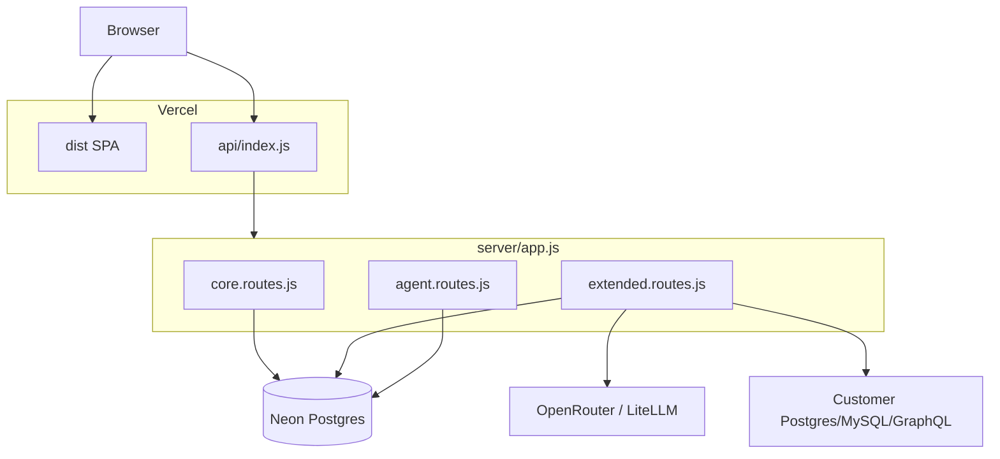

# Vercel deployment — Phase 2: Auto-BI, Connectors, Embed, Agent

This document extends [vercel-deployment.md](./vercel-deployment.md) (Phase 1 / **core mode**). Phase 2 enables the remaining backend features on **Vercel + Neon PostgreSQL** without falling back to local SQLite.

## Goal

Set `TINIX_FEATURES=full` on Vercel and serve:

| Feature | Routes | External deps |
|---------|--------|---------------|
| **Auto-BI** | `/api/auto-bi/*` | OpenRouter or LiteLLM |
| **Connectors** | `/api/connectors/*`, connector-backed `/api/datasets/*` | Target DBs/APIs + `CONNECTOR_SECRET` |
| **Embed** | `/api/embed/*` | `EMBED_JWT_SECRET` |
| **Agent API** | `/api/agent/v1/*` | `AGENT_JWT_SECRET` or `EMBED_JWT_SECRET` |

Phase 1 already created the Neon schema for all tables (`embed_apps`, `agent_apps`, `db_connectors`, `agent_audit_log`, etc.) in [`server/db/schema.postgres.js`](../server/db/schema.postgres.js). Phase 2 is mostly **route + service migration** from sync SQLite to async Postgres.

## Current gap

```
TINIX_FEATURES=core  →  core.routes.js (Neon) + disabled.routes.js (501)
TINIX_FEATURES=full  →  full.routes.js (SQLite only) — not usable on Vercel
```

Services still bound to SQLite:

| Module | SQLite calls | Notes |
|--------|--------------|-------|
| [`server/embed.service.js`](../server/embed.service.js) | 10× `db.prepare` | publish/unpublish, embed apps |
| [`server/agent.service.js`](../server/agent.service.js) | 8× `db.prepare` | agent apps, audit log |
| [`server/agent.routes.js`](../server/agent.routes.js) | 6× `db.prepare` | catalog, builder, connector proxy |
| [`server/routes/full.routes.js`](../server/routes/full.routes.js) | all extended routes | auto-bi, connectors, embed HTTP routes |

[`server/db/postgres.js`](../server/db/postgres.js) already provides `queryAll`, `queryOne`, `execute`, `withTransaction`.

## Target architecture



When `TINIX_FEATURES=full` on Vercel:

1. Mount **core** + **extended** + **agent** route modules (all async Postgres).
2. Remove [`server/routes/disabled.routes.js`](../server/routes/disabled.routes.js) from the mount chain.
3. Deprecate [`server/routes/full.routes.js`](../server/routes/full.routes.js) for production; keep temporarily for local SQLite dev or delete once parity is verified.

## Implementation plan (vertical slices)

Follow TDD-friendly order: shared DB layer first, then one feature at a time.

### Slice 0 — Shared DB adapter (blocking)

**Purpose:** One async data access layer for all services.

**Tasks:**

1. Add [`server/db/index.js`](../server/db/index.js) re-exporting [`server/db/postgres.js`](../server/db/postgres.js).
2. Refactor [`server/embed.service.js`](../server/embed.service.js) and [`server/agent.service.js`](../server/agent.service.js):
   - Replace `db.prepare(...).get/run/all` with `await queryOne / execute / queryAll`.
   - Mark all exported functions that touch DB as `async`.
3. Update callers in [`server/agent.routes.js`](../server/agent.routes.js) and future route modules to `await` service calls.
4. Add [`server/__tests__/embed.service.test.js`](../server/__tests__/embed.service.test.js) and agent service tests using a test `DATABASE_URL` or mocked pool.

**Acceptance:** Embed + agent unit tests pass against Neon (or test container).

---

### Slice 1 — Auto-BI on Neon

**Routes to port** (from `full.routes.js` → new [`server/routes/auto-bi.routes.js`](../server/routes/auto-bi.routes.js)):

- `GET /api/auto-bi/providers`
- `POST /api/auto-bi/analyze`
- `POST /api/auto-bi/suggest`
- `POST /api/auto-bi/generate` (writes project via Postgres)

**Env vars (Vercel):**

| Variable | Required |
|----------|----------|
| `OPENROUTER_API_KEY` or `LITELLM_*` | Yes |
| `AI_PROVIDER` | Optional |

**Vercel function config** — LLM calls can exceed 30s. Update [`vercel.json`](../vercel.json):

```json
{
  "functions": {
    "api/index.js": {
      "maxDuration": 120,
      "memory": 1024
    }
  }
}
```

Pro plan may be required for `maxDuration` > 60 on Hobby.

**Acceptance:**

- Data Management → Auto-BI Wizard: Analyze + Suggest + Generate dashboard on Vercel preview.
- `POST /api/auto-bi/analyze` returns 200 (not 501).

---

### Slice 2 — Connectors + Query Lab

**Routes to port** → [`server/routes/connector.routes.js`](../server/routes/connector.routes.js):

- `/api/connectors/engines`, CRUD, test, schemas, tables, columns, query
- Dataset extensions in [`server/routes/core.routes.js`](../server/routes/core.routes.js) or [`server/routes/dataset.routes.js`](../server/routes/dataset.routes.js):
  - `POST /api/datasets/from-query`
  - `POST /api/datasets/from-table`
  - `POST /api/datasets/:id/refresh`
  - `GET /api/datasets/:id` with `refresh_policy=on_load` + connector refresh
  - `formatDatasetRow` connector name lookup

**Env vars:**

| Variable | Required |
|----------|----------|
| `CONNECTOR_SECRET` | Yes (min 16 chars) — encrypts connector passwords/tokens at rest |

**Serverless notes:**

- [`server/connector.service.js`](../server/connector.service.js) `QUERY_TIMEOUT_MS = 30000` fits within 30–60s function limit; keep it.
- `pg`, `mysql2`, `graphql` are already in [`server/package.json`](../server/package.json); ensure Vercel install includes `npm install --prefix server`.
- Neon **cannot** be used as the connector target for the app's own metadata DB — customer connectors point to *their* databases over the public internet (ensure Neon/Vercel egress allows it).

**Acceptance:**

- Create Postgres/MySQL connector, run Query Lab query, save dataset from query.
- Connector-backed dataset refresh works on Vercel.

---

### Slice 3 — Embed publishing

**Routes to port** → [`server/routes/embed.routes.js`](../server/routes/embed.routes.js):

- `/api/embed/config`, apps CRUD, token, dashboard viewer, publish/revoke, preview-token

**Depends on:** Slice 0 (async `embed.service.js`).

**Env vars:**

| Variable | Required |
|----------|----------|
| `EMBED_JWT_SECRET` | Yes (min 32 chars) |
| `EMBED_TOKEN_TTL_SECONDS` | Optional (default 300) |

**Acceptance:**

- Publish dashboard from editor → Integrate panel → mint embed token → `GET /api/embed/dashboard/:id` with Bearer JWT.
- `public/tinix-embed.js` loads published viewer on external origin (CORS + allowed origins).

---

### Slice 4 — Agent API + MCP

**Routes:** [`server/agent.routes.js`](../server/agent.routes.js) — already a router; migrate DB calls to async Postgres (Slice 0).

**Env vars:**

| Variable | Required |
|----------|----------|
| `AGENT_JWT_SECRET` or `EMBED_JWT_SECRET` | Yes |
| `AGENT_TOKEN_TTL_SECONDS` | Optional |

**Serverless fix — idempotency:**

[`server/agent.routes.js`](../server/agent.routes.js) uses an in-memory `idempotencyCache` (`Map`). This **does not work** across Vercel function instances.

**Options (pick one):**

1. **Neon table** `agent_idempotency_keys (key TEXT PRIMARY KEY, response JSONB, expires_at TIMESTAMPTZ)` — recommended, no extra infra.
2. **Vercel KV / Upstash Redis** — if you already use KV elsewhere.

**Acceptance:**

- Data Management → Agent Integration: create app, copy API key.
- `POST /api/agent/v1/token` → Bearer calls to catalog + `tinix_generate_dashboard` via MCP against deployed URL.
- Audit log rows appear in `agent_audit_log` on Neon.

---

### Slice 5 — Wire `app.js` + feature flags

**Update [`server/app.js`](../server/app.js):**

```js
const mode = getFeatureMode(); // 'core' | 'full'

mountCoreRoutes(app);

if (mode === 'full') {
  mountAutoBiRoutes(app);
  mountConnectorRoutes(app);
  mountEmbedRoutes(app);
  app.use('/api/agent/v1', createAgentRouter({ resolveAutoBiProvider }));
  app.use('/docs/openapi', express.static(...));
} else {
  mountDisabledRoutes(app);
}
```

**Update [`server/config/features.js`](../server/config/features.js):**

- `TINIX_FEATURES=full` on Vercel enables all modules.
- Optional granular flags later: `TINIX_FEATURES=core,auto-bi,connectors` (comma-separated).

**Health endpoint:**

```json
{
  "status": "ok",
  "features": "full",
  "database": "neon",
  "modules": ["core", "auto-bi", "connectors", "embed", "agent"]
}
```

**Vercel env:** set `TINIX_FEATURES=full`.

---

### Slice 6 — Frontend (optional but recommended)

Hide unavailable tabs when the API reports core-only:

1. Add `GET /api/health` consumer on Data Management mount.
2. Or build-time `VITE_TINIX_FEATURES=full` in Vercel project env (requires rebuild to toggle).

Files:

- [`src/views/project/dataManagement/index.vue`](../src/views/project/dataManagement/index.vue)
- i18n keys in [`src/i18n/en/agent.ts`](../src/i18n/en/agent.ts) / vi

---

## Environment variables (Phase 2 complete)

| Variable | Phase | Purpose |
|----------|-------|---------|
| `DATABASE_URL` | 1+ | Neon pooled connection |
| `TINIX_FEATURES` | 2 | `full` |
| `HUSKY` | 1+ | `0` on Vercel build |
| `OPENROUTER_API_KEY` | Auto-BI | LLM |
| `OPENROUTER_MODEL` | Auto-BI | Optional |
| `LITELLM_*` | Auto-BI | Alternative provider |
| `CONNECTOR_SECRET` | Connectors | Encrypt secrets at rest |
| `EMBED_JWT_SECRET` | Embed | JWT signing |
| `EMBED_TOKEN_TTL_SECONDS` | Embed | Optional |
| `AGENT_JWT_SECRET` | Agent | Optional fallback to embed secret |
| `AGENT_TOKEN_TTL_SECONDS` | Agent | Optional |

Update [`.env.example`](../.env.example) when each slice lands.

## Vercel configuration changes

| Setting | Phase 1 | Phase 2 |
|---------|---------|---------|
| `maxDuration` | 30s | **60–120s** (Auto-BI + connectors) |
| `memory` | 1024 MB | 1024–3009 MB if LLM JSON parsing is heavy |
| Body limit | 4 MB | Still **4.5 MB** platform cap — no change unless Vercel Blob added |

## Known limits (unchanged)

- **4.5 MB** request/response per function — large datasets and private photos still capped.
- **Cold starts** — first Auto-BI request after idle may be slow; acceptable for admin UI.
- **SQLite connector engine** — [`server/connector.service.js`](../server/connector.service.js) supports SQLite connectors pointing at *files*; file paths are meaningless on Vercel serverless. Document: SQLite connector type is **local-dev only**; disable or hide on Vercel UI.
- **Long-running connector queries** — keep `MAX_LIMIT` / timeouts; consider async job queue only if customers need >60s queries.

## Testing checklist

| Test | Command / action |
|------|------------------|
| Schema | `DATABASE_URL=... npm run migrate:neon` |
| Health | `curl .../api/health` → `features: full` |
| Auto-BI | Wizard analyze + suggest on sample CSV |
| Connector | Create PG connector, run read-only SELECT |
| Dataset refresh | Connector dataset with `on_load` policy |
| Embed | Publish → token → embed viewer |
| Agent | Mint JWT → `GET /api/agent/v1/datasets` |
| Idempotency | Repeat `POST` with same `Idempotency-Key` → same response |
| Regression | Core CRUD still works (projects, upload datasets) |

## Suggested PR breakdown

| PR | Scope |
|----|-------|
| 1 | DB adapter + async embed/agent services + tests |
| 2 | `auto-bi.routes.js` + vercel maxDuration |
| 3 | `connector.routes.js` + dataset connector routes |
| 4 | `embed.routes.js` |
| 5 | Agent routes + Neon idempotency table |
| 6 | `app.js` wiring, remove disabled stubs, docs + `.env.example` |

## Rollback

Set `TINIX_FEATURES=core` on Vercel to instantly revert to Phase 1 behavior (501 on extended routes) without redeploying code.

## Local development after Phase 2

Prefer Neon for parity:

```bash
TINIX_FEATURES=full
DATABASE_URL=postgresql://...
npm run dev:all
```

Optional: keep `TINIX_FEATURES=full` without `DATABASE_URL` to use SQLite via legacy `full.routes.js` until Phase 2 is complete and legacy path is removed.
